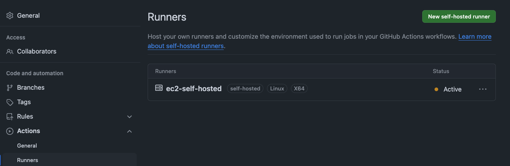
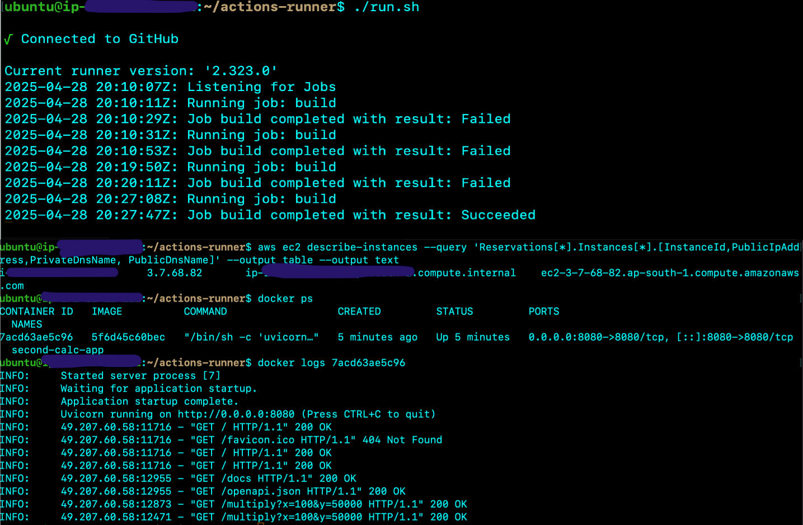
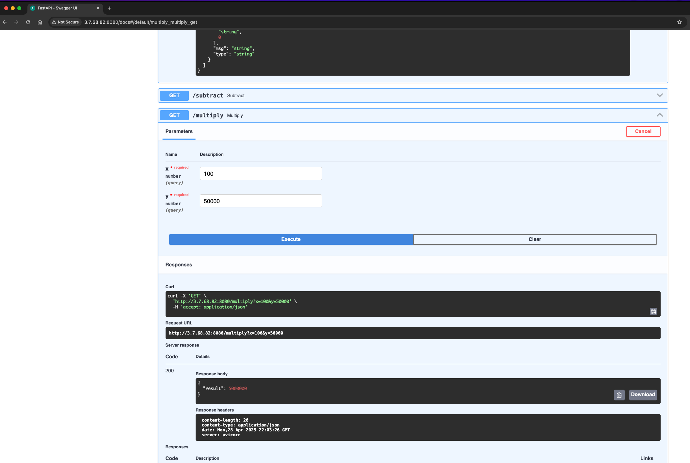

# gihub-actions-self-hosted-ecr-image

A minimal Python project demonstrating Docker best practices, GitHub Actions self hosted runner, and secure dependency management using [uv package manager](https://docs.astral.sh/uv/).

## Project Structure

- `calculator.py` — Main application logic
- `test_calculator.py` — Unit tests for the calculator run via pytest
- `pyproject.toml` — Project metadata and dependencies
- `uv.lock` — Lockfile for reproducible installs
- `Dockerfile` — Containerization with security best practices
- `FastAPI & Uvicorn` — Web framework and ASGI server for serving the app
- `.github/workflows/ci-self-hosted.yml` — GitHub Actions workflow via self-hosted runner

## CI/CD on EC2 Self-Hosted Runner

This project is designed to run on an **EC2 instance** using a self-hosted GitHub Actions runner.  
See [`.github/workflows/ci-self-hosted.yml`](.github/workflows/ci-self-hosted.yml) for the workflow configuration.

## Local Development Steps

1. **Install [uv](https://github.com/astral-sh/uv) and check version:**
   ```sh
   pip3 install uv
   uv --version
   ```
2. **Create and activate a virtual environment:**
   ```sh
   uv venv
   source .venv/bin/activate
   ```
3. **Add and install single dependency:**
   ```sh
   uv add pytest
   ```

4. **Add and install all dependencies from `uv.lock` file:**
   ```sh
   uv sync
   ```

5. **Run the app locally:**
   ```sh
   uv run calculator.py
   ```
6. **Run test cases locally:**
   ```sh
   uv run pytest -vs test_calculator.py
   ```

## Docker Usage

1. **Build the image:**
   ```sh
   docker build -t gh-actions-self-hosted-calc-app .
   ```
2. **Run the container (listening on port 8080):**
   ```sh
   docker run -p 8080:8080 gh-actions-self-hosted-calc-app
   ```

## Docker Build and Push to AWS ECR repository

The following steps (see [ci-self-hosted.yml](.github/workflows/ci-self-hosted.yml)) are used to build and push the Docker image to AWS ECR:

```sh
# Authenticate Docker to the ECR registry
aws ecr get-login-password --region <AWS_REGION> | docker login --username AWS --password-stdin <AWS_ACCOUNT_ID>.dkr.ecr.<AWS_REGION>.amazonaws.com

# Build the Docker image with a tag (e.g., short SHA and date)
SHORT_SHA=$(echo $GITHUB_SHA | tail -c 6)
TAG_DATE=$(date +"%d-%b-%y")
IMAGE_TAG="${SHORT_SHA}-${TAG_DATE}"
docker build . --file Dockerfile --tag <ECR_REGISTRY>/<ECR_REPOSITORY>:${IMAGE_TAG}

# Push the image to ECR
docker push <ECR_REGISTRY>/<ECR_REPOSITORY>:${IMAGE_TAG}
```

## Prerequisites

- EC2 instance must have Docker installed and AWS CLI configured.

- The GitHub self-hosted runner must be running and listening for jobs when the pipeline runs. Refer to official documentation how to setup the runner: [GitHub Adding self-hosted runners](https://docs.github.com/en/actions/hosting-your-own-runners/managing-self-hosted-runners/adding-self-hosted-runners)

   Once done, there would be a `run.sh` script available which would help start the runner using command:

  ```sh
  ./run.sh
  ```
  Ensure this command is kept running in the terminal or as a background process before triggering the workflow.

- Add an inbound traffic rule in the EC2 instance to allow traffic from the port where the application runs

# Pulling and Running the ECR Image on EC2 instance

1. **Authenticate Docker to your ECR registry:**
   ```sh
   aws ecr get-login-password --region <AWS_REGION> | docker login --username AWS --password-stdin <AWS_ACCOUNT_ID>.dkr.ecr.<AWS_REGION>.amazonaws.com
   ```
2. **Pull the image from ECR:**
   ```sh
   docker pull <ECR_REGISTRY>/<ECR_REPOSITORY>:<IMAGE_TAG>
   ```
3. **Run the container:**
   ```sh
   docker run -d -p 8080:8080 --name calc-app <ECR_REGISTRY>/<ECR_REPOSITORY>:<IMAGE_TAG>
   ```

4. **Evaluate docker logs to for the app events:**
   ```sh
   docker logs calc-app
   ```

# Serving the App with FastAPI & Uvicorn

The app is served using FastAPI as the web framework and Uvicorn as the ASGI server. When the container runs, it starts the FastAPI app on port 8080 using the following command:

```sh
uvicorn calculator:app --host 0.0.0.0 --port 8080
```


# Screenshots

## Actions Self Hosted runner in Active state



## Successful EC2 Hosted Runner Deployment



## FastAPI App server running on EC2 (Self-Hosted)




## Security Best Practices
- Uses a non-root user in Docker
- Only exposes necessary ports
- Uses `uv` for secure, reproducible dependency management
- Keeps dependencies and code separate for better caching

---

MIT License